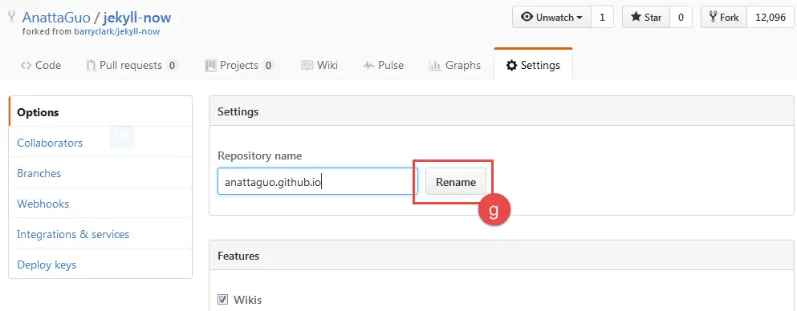
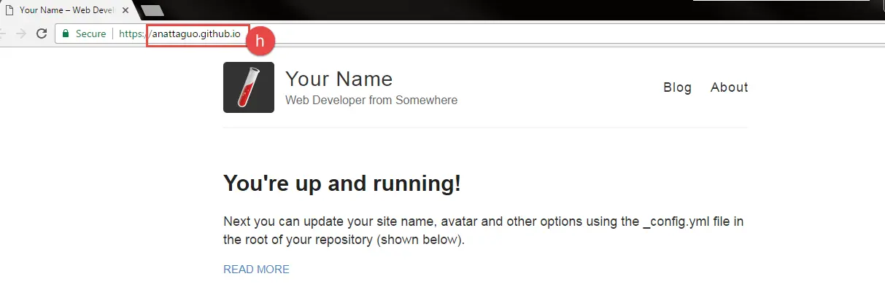
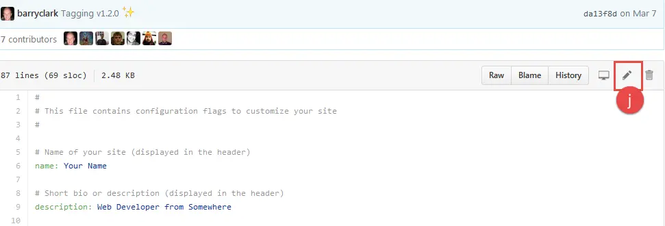
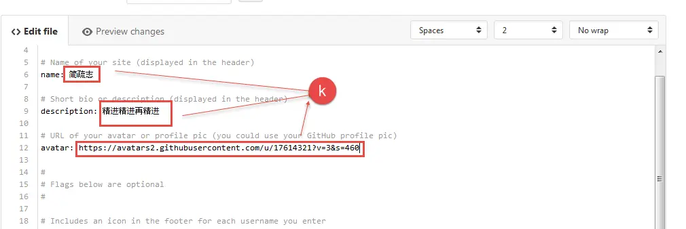
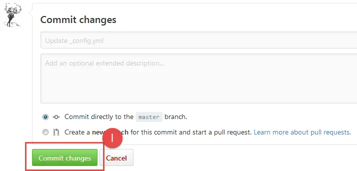
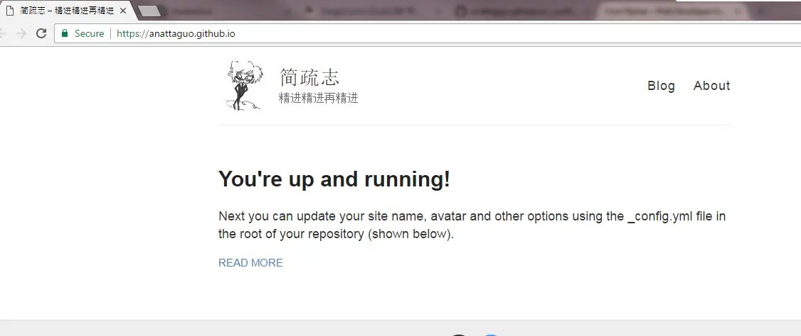
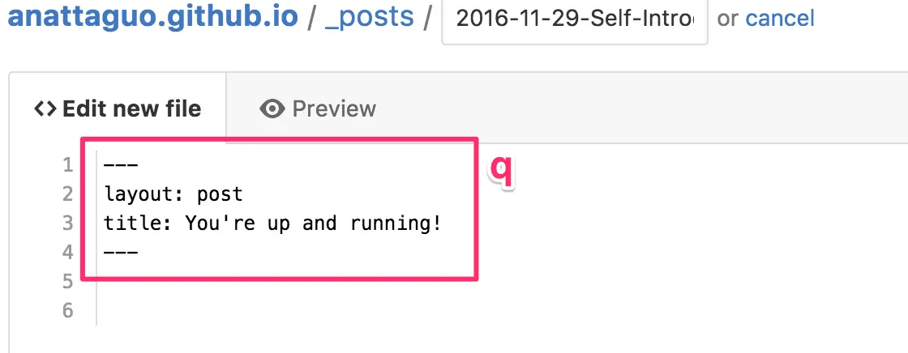
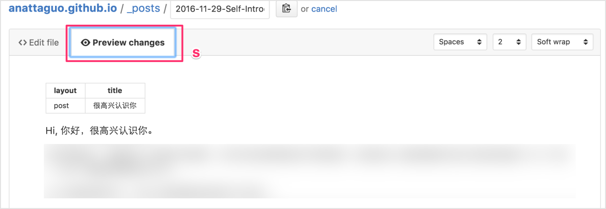

> 此教程不需要下载任何安装程序，只要你有浏览器就可以操作。  
> 过以下步骤，可以使你熟悉整个 Github 操作流程及关键概念。

## Step 0 步骤概览

- Step 1 创建博客
- Step 2 配置博客
- Step 3 发布日志

<!--truncate-->

## Step 1 创建博客

### 1.1 创建自己的 Github 账号

首先，你得有个 Github 的账号。如果没有 Github 账号，请登录[Github](https://github.com/)创建一个。

> 注意：github 的 username 会用在个人博客地址里，所以请谨慎选择。

### 1.2 Fork 一个 Jekyll 模板

这里以 `jekyll-now` 这个模板仓库（Repository）为例说明如何 fork 一个仓库。
**a**. 登录 github  
**b**. 在 Github 的搜索框里输入`jekyll-now`找到此仓库  
**c**. 点击 Fork


**d**. 选择自己的账号


Forking 中，请耐心等待  


Fork 成功后，显示如下:


### 1.3 更改模板仓库名字(Rename)

**e**. 进入设置（setting）


**f**. 将模板仓库名字`jekyll-now`名字改为`yourusername.github.io` （这个就是你的博客地址了）， 也就是你的 github 的`username`+`github.io`。例子请见下一步骤 g。


**g**. 输入完毕，点击 `Rename`:



### 1.4 预览博客

**h**. 在浏览器中输入你的博客地址`yourusername.github.io`，例如我的是`anattaguo.github.io` (https://anattaguo.github.io/), 如下图所示。此时，页面成功显示。博客搭建大功告成。



## Step 2 配置博客

### 2.1 更改博客标题、描述及头像

**i**. 在自己的博客仓库下，找到`_config.yml` 文件，点击打开


**j**. 点击小铅笔图标，进入编辑模式


**k**. 修改名字、描述及头像

```yml
#
# This file contains configuration flags to customize your site
#
# Name of your site (displayed in the header)
name: Your Name ##**在这里填入你的博客名字**
# Short bio or description (displayed in the header)
description: Web Developer from Somewhere ## **在这里填入你的博客**
# URL of your avatar or profile pic (you could use your GitHub profile pic)
avatar: https://raw.githubusercontent.com/barryclark/jekyll-now/master/images/jekyll-logo.png ##**将此地址替换为你的头像地址**
```

我的是这样的：



**l**. 修改好后，点 `commit` 提交。`Commit changes` 可以填，也可以不填:



### 2.2 预览配置后博客

**m**. 在浏览器中再次输入自己的博客名字，浏览自己的博客（参考步骤 h）



## Step 3 发布日志

### 3.1 创建日志文件

**n**. 在自己的博客仓库下找到`post`文件夹，点击进入:


**o**. 点击`create new file` 创建日志文件:


**p**. 输入日志文件名称，格式为`yyyy-mm-dd-xxx-xxx.md`，如`2016-11-29-Self-Introduce.md`

:::info 注意

1.  日志文件名一定要以`.md`结尾
2.  日志文件名之间一定要有连字符 `-`
3.  日志文件名不可以包含中文字符


:::

### 3.2 撰写日志

**q**. 将以下内容复制黏贴到编辑器中，将`title`后面的文字改为日志的标题， `layout: post` 不用修改

```yml
---
layout: post
title: You're up and running! ## 在这里输入你的日志标题，如“我是谁？”
---
```



**r**. 用 markdown 语法写日志:


**s**. 输入完成后，可以点击`Preview changes`对写好对日志进行预览



**t**. 点击`commit`提交日志（参考步骤 l）

**u**. 预览日志，打开自己的博客地址，发现刚写的日志已经发布完成了。


祝贺你，到这里，利用 Jeklly+Github 创建个人博客就大功告成了。
